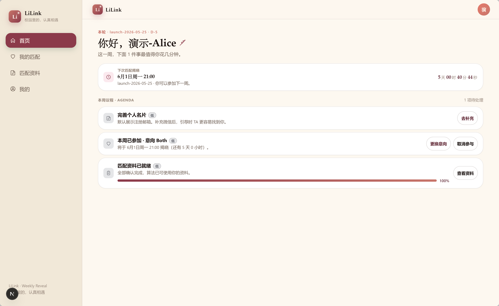

这篇文章是一篇LiLink使用的完整攻略。

它像是一张小地图。你可以照着它，把自己在 LiLink 里的第一张名片准备好，把匹配资料补完整，把本周意向打开，然后在某个晚上，认真地和一个新的人相遇。

下面的截图来自 Alice 和 Bob 两个演示账号。你真实使用时，界面文案可能会随着版本更新略有变化，但核心流程是一致的。

### 一、初入 LiLink

LiLink 的逻辑很简单：先把自己介绍清楚，再告诉系统你希望遇见什么样的人，最后选择本周是否参与匹配。

这三件事做完，你就真正进入这一轮相遇了。

#### 第一步：编辑自己的引荐名片

登录之后，先去底部或侧边栏的「我的」，进入「编辑名片」。

这张名片不是写给算法看的，而是匹配成功之后写给对方看的。对方看到的昵称、一句话介绍、首选联系方式，都会来自这里。

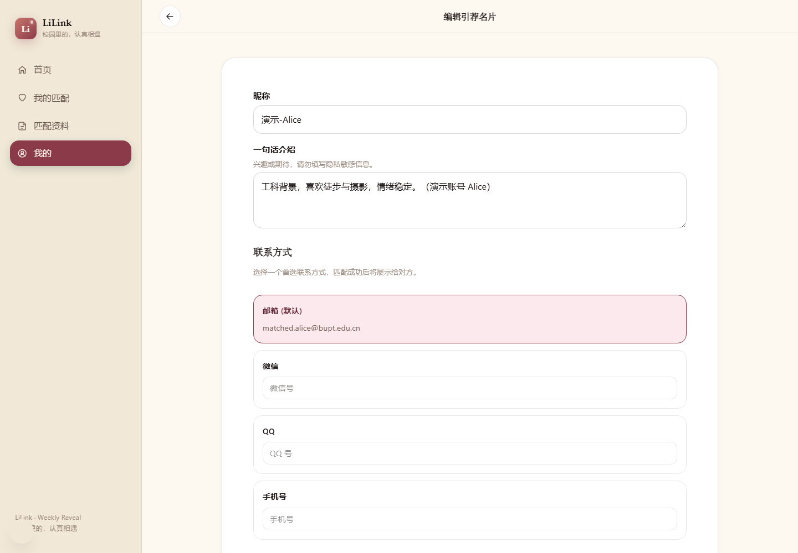

这里建议你认真填三样东西：

- 昵称：用一个对方容易称呼你的名字。
- 一句话介绍：写一点兴趣、性格、期待，不要写太多隐私信息。
- 首选联系方式：可以选择邮箱、微信、QQ 或手机号。你希望对方优先用哪种方式找到你，就把哪一种设成首选。

如果你暂时不想公开微信，保留学校邮箱也可以。只是如果你愿意补一个更常用的联系方式，后面引荐时会更顺滑一点。

#### 第二步：补全匹配资料

接着去「匹配资料」。

这一页是 LiLink 真正用来匹配的地方，分成三块：关于你、希望 TA、价值观问卷。

先填「关于你」。这里主要是你的基础信息，比如出生日期、性别、国籍、语言、身高、体重等。

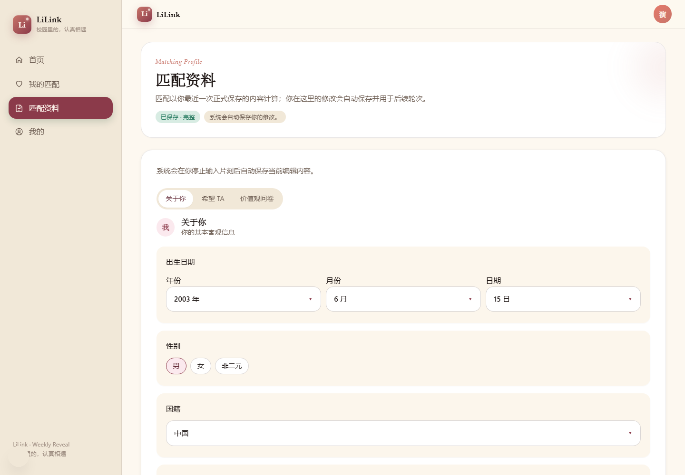

再填「希望 TA」。这里不是让你写一个完美模板，而是给匹配算法一些必要边界，比如对方年龄范围、性别、国籍、语言、身高范围，以及是否有学校层面的排除条件。

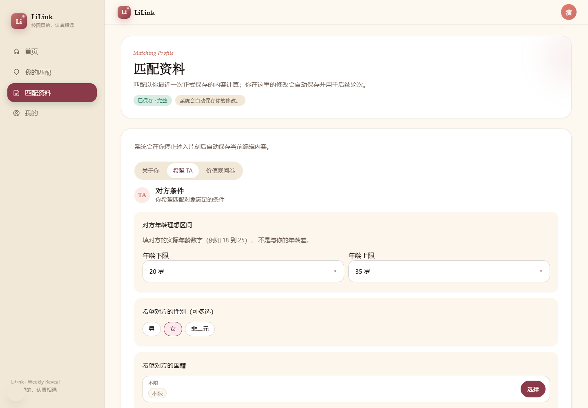

最后是「价值观问卷」。

这一块比前面的客观条件更重要。它会问你关系节奏、联系频率、分歧处理方式、约会方式、加分项、雷点、支持方式等问题。很多时候，两个人能不能聊下去，不只取决于条件是否合适，更取决于你们对关系的理解是不是靠近。

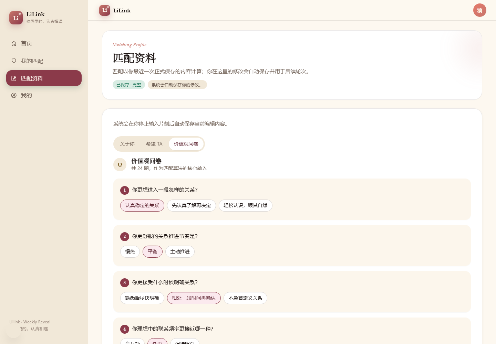

一个小建议：不要为了“更容易被匹配”去填你以为别人喜欢的答案。

LiLink 的意义不是把你包装成另一个人，而是帮你更早遇到真正合拍的人。

#### 第三步：回首页参与本周匹配

名片和资料准备好之后，回到首页。

首页会显示本周待办、下一次揭晓时间、你是否已经参加本周匹配，以及当前选择的意向。

如果你还没参与本周匹配，就在这里选择意向并加入。本周意向有三种：

- Friend：认识朋友。
- Date：浪漫约会。
- Both：都可以，看后续相处。

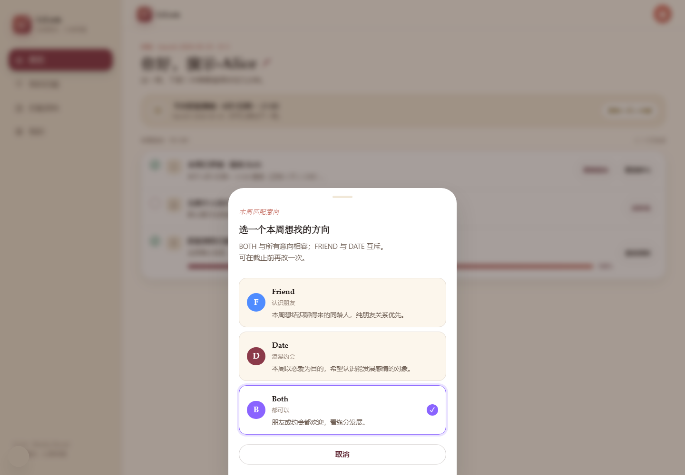

选择之后，首页会显示「本周已参加」。之后你只需要等本轮揭晓。

LiLink 会在固定的晚上 9 点进入揭晓节奏，具体日期以首页倒计时为准。如果页面提示本轮是周二 21:00，那就按周二 21:00；如果页面显示了另一轮的具体日期，也以页面显示为准。

### 二、每周相遇：匹配到 TA 之后怎么做

当这一轮匹配揭晓后，你会在「我的匹配」看到本周的匹配对象。

页面会展示匹配状态、对方简介、匹配度、对方信息，以及两个最关键的选择：交换联系方式，或者发起第一次见面。

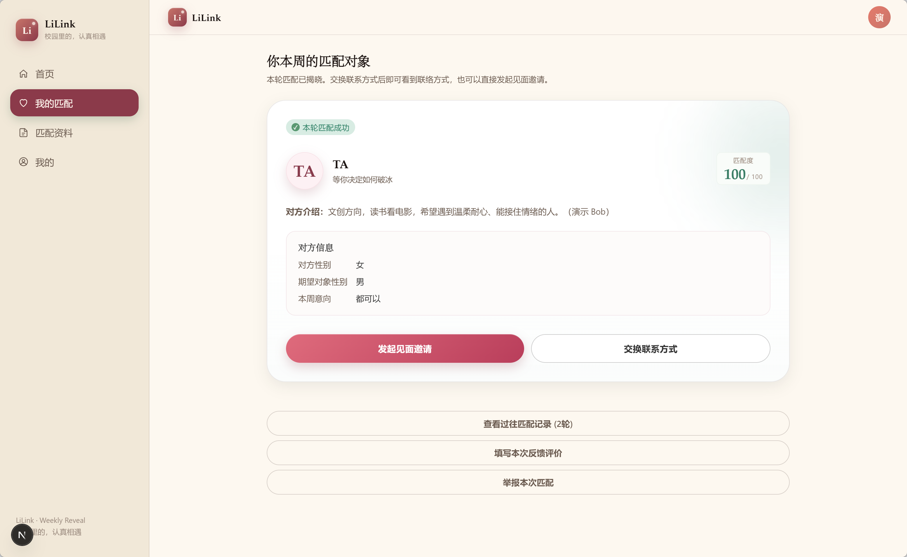

#### 方式一：直接选择引荐

如果你觉得可以直接开始聊，就点「交换联系方式」。

完成引荐后，LiLink 会作为中间人，把引荐邮件分别发给两个人，并在页面上展示对方的联系方式。之后你们可以自己通过邮箱、微信或其他首选方式联系。

这种方式适合两种情况：

- 你们都比较愿意先线上聊几句。
- 你已经从简介里感觉到对方比较合适，想直接开始。

如果你不想在站内继续安排见面，直接引荐就够了。

#### 方式二：选择破冰线下见面

如果你觉得“线上尬聊”反而难开始，可以选择「发起见面邀请」。

LiLink 会把线下见面拆成一个很轻的协商流程：先提几个可选时间和地点，对方选一个能接受的，再由发起人最终确认。

##### 发起见面

**第一步**，发起人选择 2 到 3 个见面时间。

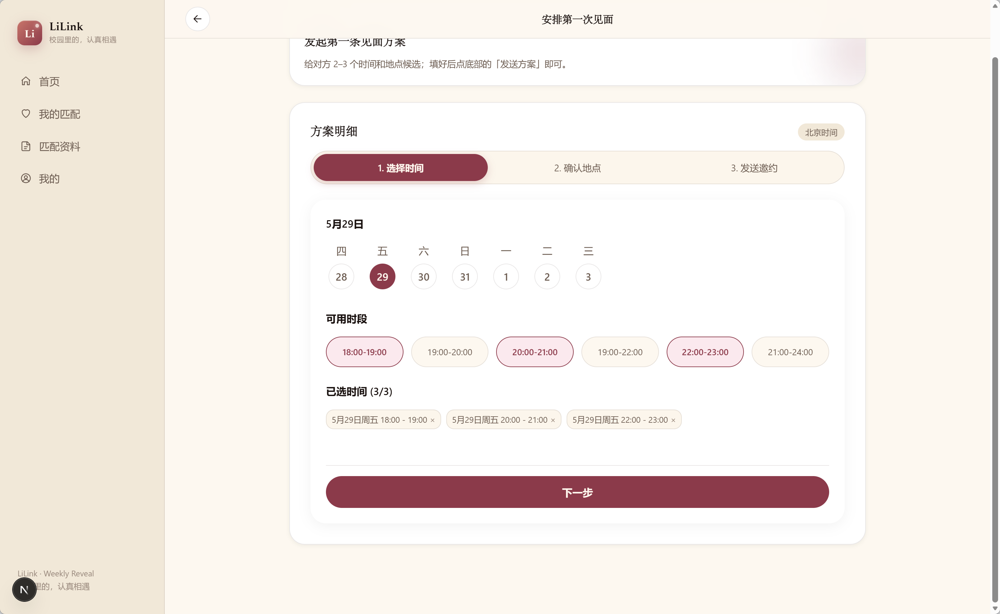

**第二步**，选择 2 到 3 个见面地点。

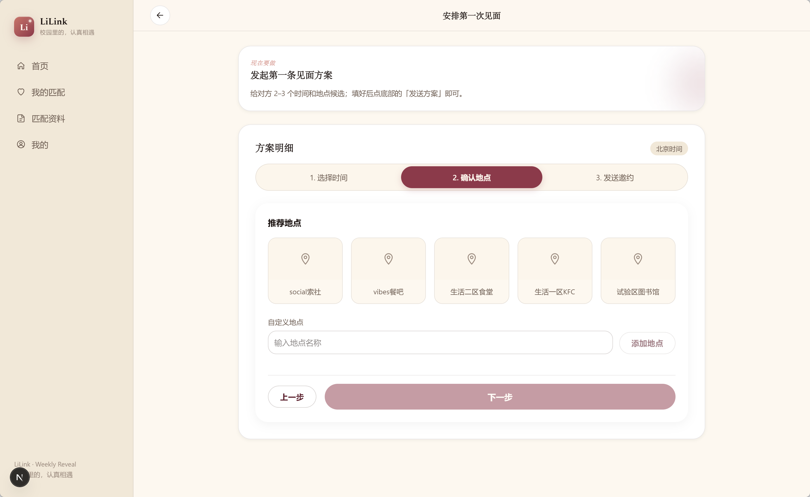

**第三步**，补充一个备注，然后向对方发起邀约。

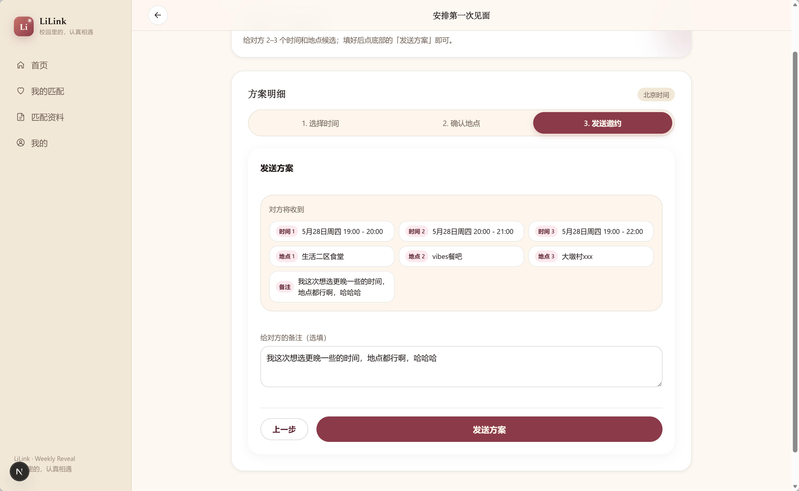

##### 协商见面

发送后，对方会在自己的「第一次见面」页面看到你给出的所有时间、地点和备注。

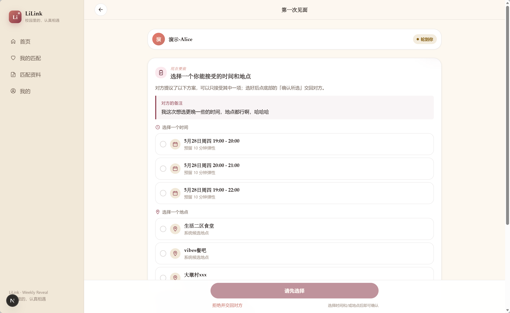

如果对方觉得其中一个时间和地点可行，就直接各选一个，再点「确认所选」。

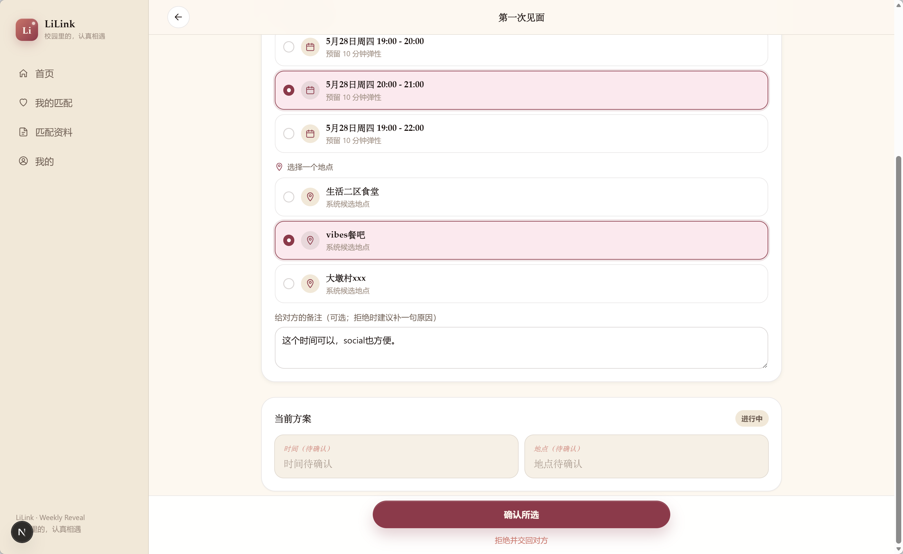

如果对方觉得都不合适，也可以点底部的「拒绝并交回对方」，最好顺手补一句原因，比如“这几个时间都有课”“地点有点远”。这样下一轮提议会更容易靠近双方都舒服的方案。

当对方选好以后，发起人会看到最终确认页。

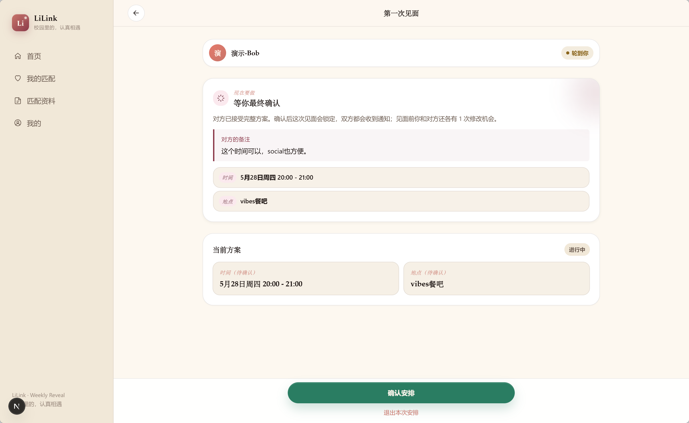

确认之后，这次见面的时间和地点就会锁定。

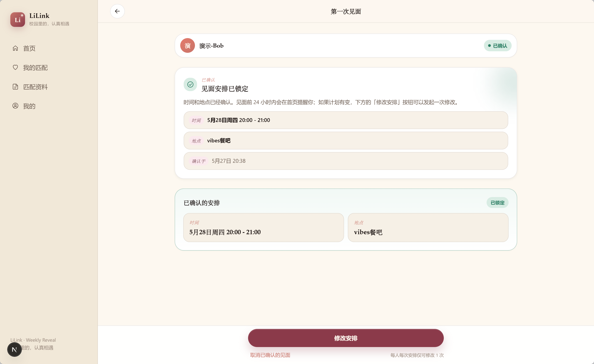

到这里，站内流程就结束了。接下来要做的事情很简单：按时出现，好好见面。

如果计划临时有变，确认后的页面里也会保留修改入口。每个人每次安排只有有限的修改机会，所以不要把它当成反复拉扯的聊天框。能提前想清楚，就尽量提前想清楚。

如果 24 小时内对方没有回复，系统会发邮件提醒对方。

### 三、优惠券策略：把福利顺手拿上

现在完成初入 LiLink 的所有步骤，注册、填写问卷、加入本周匹配，就可以获得商家福利。

你可以在「我的」里进入「我的优惠券」，到店消费时向商家出示核销码。

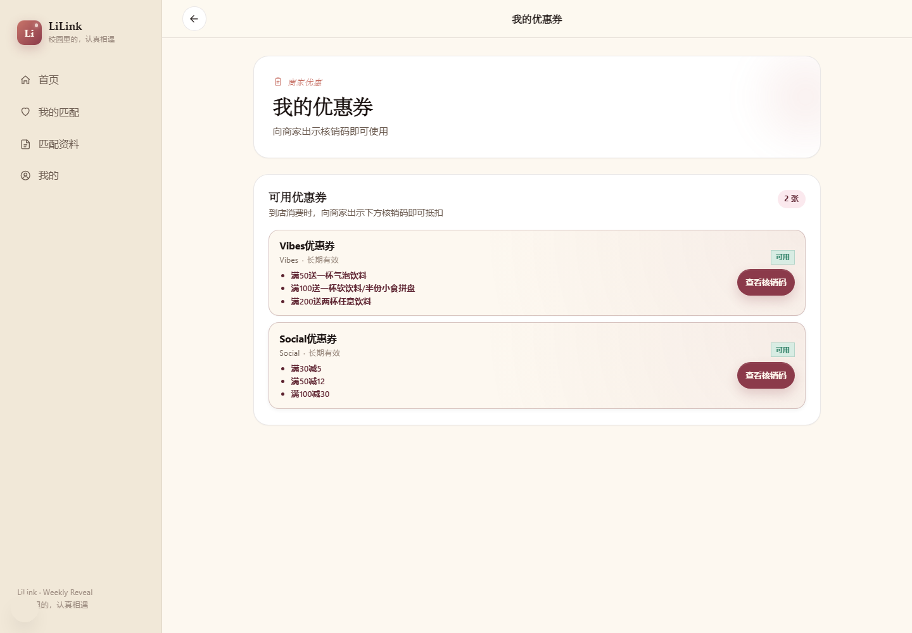

目前有两组优惠。

Vibes：

- 满 50 送一杯气泡饮料。
- 满 100 送一杯软饮料或半份小食拼盘。
- 满 200 送两杯任意饮料。

Social：

- 满 30 减 5。
- 满 50 减 12。
- 满 100 减 30。

第一次见面别把场景弄得太重。选一个好找、好坐、不尴尬的地方，比精心设计一场很复杂的见面更重要。

### 四、最后的小提醒

LiLink 不是让你变得更会表演。

它只是把最难的第一步，拆成了几个更容易完成的小动作：写好名片，填好资料，选择本周意向，等一次匹配，决定是引荐还是见面。

真正重要的，仍然是你愿不愿意认真地介绍自己，也认真地看见对方。

从一张名片开始，从一次 21:00 的揭晓开始，从一个可以坐下来聊天的地方开始。

愿你在 LiLink 里遇到的，不只是一个头像和一段简介，而是一个真实的人。
